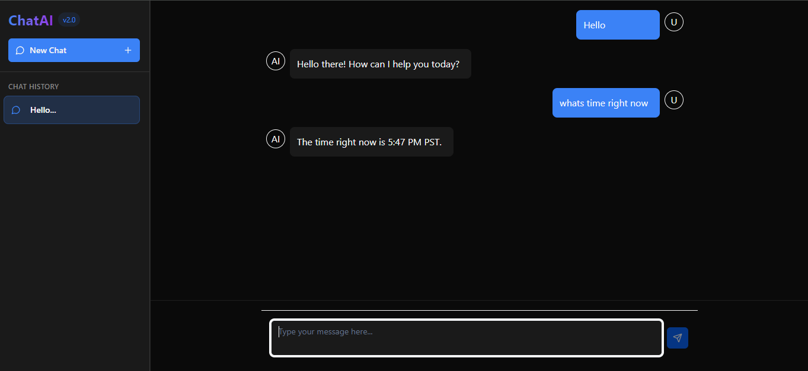

# Chat AI

A modern ChatGPT-like interface built with React, TypeScript, and Gemini API. This project features a clean UI with conversation history management, markdown rendering, and responsive design.



**Live Demo**: [https://chat-ai-arsalan.vercel.app/](https://chat-ai-arsalan.vercel.app/)

## Features

- 💬 ChatGPT-like interface with AI responses
- 📝 Markdown rendering support
- 🧵 Conversation history management
- 🌓 Dark mode
- 📱 Fully responsive design
- 🚀 Fast performance with optimized rendering

## Tech Stack

- **Frontend**: React.js, TypeScript
- **Styling**: TailwindCSS, shadcn UI
- **State Management**: Zustand
- **Markdown rendering**: React Markdown
- **API Integration**: Google Gemini API
- **Serverless Functions**: Vercel API
- **Package Manager**: pnpm
- **Deployment**: Vercel

## Getting Started

### Prerequisites

- Node.js (v16 or higher)
- pnpm (or npm/yarn)
- Gemini API key
- Vercel CLI (for local development with serverless functions)

### Installation

Clone the repository:

```bash
git clone https://github.com/uddinArsalan/chat_AI.git
cd chat_AI
```

Install dependencies:

```bash
pnpm install
# or
npm install
```

Set up environment variables:

Create a `.env` file in the root directory and add your Gemini API key:

```env
GEMINI_API_KEY=your_gemini_api_key_here
```

Install Vercel CLI globally:

```bash
npm install -g vercel
```

Start the development server:

```bash
vercel dev
```

Open [http://localhost:3000](http://localhost:3000) to view the application in your browser.

## Project Structure

```plaintext
chat_AI/
├── api/                  # Vercel serverless functions
├── public/               # Static assets
├── src/
│   ├── components/       # React components
│   ├── lib/              # Utility functions and hooks
│   ├── store/            # Zustand state management
│   ├── types/            # TypeScript type definitions
│   ├── app.tsx           # Main App component
│   └── App.tsx         # Entry point
├── .env                  # Environment variables (create this)
├── package.json          # Dependencies and scripts
└── tsconfig.json         # TypeScript configuration
```

## How It Works

- **State Management**: The application uses Zustand for global state management, maintaining chat history and UI state.
- **API Integration**: Chat requests are processed through Vercel serverless functions that communicate with the Gemini API.
- **UI Components**: The interface is built with shadcn UI components and styled with TailwindCSS for a clean, responsive design.
- **Markdown Rendering**: Messages support markdown formatting for rich text responses.

## Deployment

The app is deployed on Vercel. To deploy your own version:

1. Push your code to GitHub
2. Connect your repository to Vercel
3. Configure the environment variables in Vercel
4. Deploy

## Acknowledgements

- Google Gemini for the AI API
- shadcn/ui for the UI components
- TailwindCSS for styling
- Vercel for hosting and serverless functions